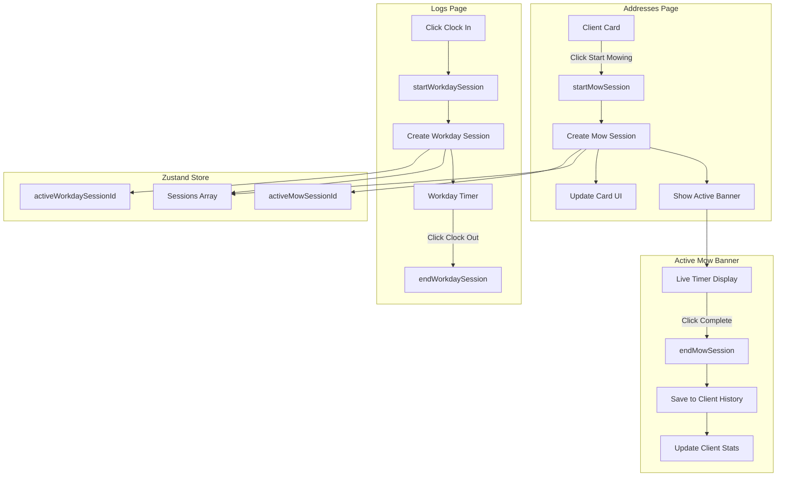

# Implementation Plan: Address-Specific Mowing Timers

## Executive Summary

This plan outlines the implementation of a **dual-timer architecture** that decouples address-level mowing timers from the general workday tracker in the Mow Log PWA.

---

## Current State Analysis

### Problem Statement
Currently, clicking "Start Mowing" on an address card:
1. Calls `startSession(clientId)` which creates a session linked to that client
2. Redirects to `/logs` page
3. The `/logs` page is designed for **general workday tracking** (clocking in when leaving home, clocking out when returning)

This conflates two distinct workflows:
- **Workday Session**: Overall workday duration (leave home → return home)
- **Address Mow Session**: Time spent mowing a specific lawn

### Current Store Structure
```typescript
// src/lib/store.ts
interface Session {
    id: string;
    clientId: string | null;  // Optional link to client
    startTime: string;
    endTime: string | null;
    breakTimeTotal: number;
    status: 'active' | 'break' | 'completed';
}

// Only ONE active session allowed
activeSessionId: string | null;
```

---

## Proposed Architecture

### 1. Store Changes - Dual Session Types

#### Option A: Add Session Type Field (Recommended)
Extend the existing Session interface with a type discriminator:

```typescript
interface Session {
    id: string;
    type: 'workday' | 'address-mow';  // NEW: Session type
    clientId: string | null;
    startTime: string;
    endTime: string | null;
    breakTimeTotal: number;
    status: 'active' | 'break' | 'completed';
}

// Separate active IDs for each type
activeWorkdaySessionId: string | null;
activeMowSessionId: string | null;
```

#### Option B: Separate Stores (Alternative)
Create a dedicated MowSession type:

```typescript
interface MowSession {
    id: string;
    clientId: string;
    startTime: string;
    endTime: string | null;
    status: 'active' | 'completed';
}

mowSessions: MowSession[];
activeMowSessionId: string | null;
```

**Recommendation**: Option A is simpler and maintains backward compatibility with existing sessions.

### 2. New Store Actions

```typescript
// Workday Session Actions
startWorkdaySession: () => void;
endWorkdaySession: () => void;

// Address Mow Session Actions
startMowSession: (clientId: string) => void;
endMowSession: () => void;

// Derived getters
getActiveMowSession: () => MowSession | null;
getActiveWorkdaySession: () => Session | null;
getClientMowSessions: (clientId: string) => MowSession[];
```

### 3. UI Components

#### A. Active Mow Timer Banner (Sticky Bottom)
A floating banner that appears when an address mow session is active:

```
┌─────────────────────────────────────────────────────────────┐
│  🌱 Mowing: John Smith                                      │
│  ─────────────────────────────────────────────────────────  │
│  00:15:32                              [Pause] [Complete]   │
└─────────────────────────────────────────────────────────────┘
```

**Features**:
- Fixed position at bottom of screen (above bottom nav)
- Shows client name and live timer
- Pause/Resume and Complete buttons
- Glass-card styling with primary accent glow
- Visible across all pages

#### B. Inline Card Active State
When a mow session is active for a specific client, their card shows:

```
┌─────────────────────────────────────────────────────────────┐
│  [JS]  John Smith                              ✏️          │
│        📍 123 Main St                                       │
│  ─────────────────────────────────────────────────────────  │
│  🌱 MOWING NOW - 00:15:32                                  │
│  ─────────────────────────────────────────────────────────  │
│  [Phone] [Size]  [Visits] [Total Time]                      │
│  ─────────────────────────────────────────────────────────  │
│  2 days ago              [Complete Mowing]                  │
└─────────────────────────────────────────────────────────────┘
```

**Features**:
- Green accent border/glow on active card
- Inline timer display
- "Complete Mowing" button replaces "Start Mowing"

#### C. Updated Addresses Page Logic

```typescript
// Remove redirect to /logs
const handleStartMowing = (clientId: string) => {
    startMowSession(clientId);
    // NO REDIRECT - stay on addresses page
};

const handleCompleteMowing = () => {
    endMowSession();
    // Session automatically saved to client history
};
```

### 4. Logs Page Changes

The `/logs` page will be updated to:

1. **Workday Timer Section**: Only handles workday sessions (no clientId)
2. **Remove Address-Specific Logic**: No longer shows "Mowing: Client Name"
3. **Keep Gas/Maintenance Logs**: These remain unchanged

```
┌─────────────────────────────────────────────────────────────┐
│  ⏰ Workday Clock-In                                        │
│  ─────────────────────────────────────────────────────────  │
│  02:45:12                              [Break] [Clock Out]  │
└─────────────────────────────────────────────────────────────┘
```

---

## Implementation Steps

### Phase 1: Store Refactoring
1. Add `type` field to Session interface
2. Add `activeWorkdaySessionId` and `activeMowSessionId` to state
3. Create `startWorkdaySession()` and `startMowSession(clientId)` actions
4. Create `endWorkdaySession()` and `endMowSession()` actions
5. Add migration logic for existing sessions (treat as workday sessions)

### Phase 2: Active Mow Timer Banner Component
1. Create `ActiveMowBanner.tsx` component
2. Implement live timer with useEffect interval
3. Add pause/resume functionality
4. Style with glass-card and primary accent

### Phase 3: Addresses Page Updates
1. Update `handleStartMowing` to use `startMowSession`
2. Remove redirect to `/logs`
3. Add inline active state for cards
4. Show banner when mow session is active

### Phase 4: Logs Page Updates
1. Update workday timer to use `startWorkdaySession`
2. Remove address-specific display logic
3. Keep gas and maintenance log sections

### Phase 5: Client Stats Integration
1. Update `getClientStats()` to use mow sessions
2. Calculate visits and total time from completed mow sessions
3. Ensure stats update when mow session completes

---

## Data Flow Diagram



---

## UI Mockup - Active Mow Banner

```
┌──────────────────────────────────────────────────────────────────┐
│                                                                  │
│  [Main Content Area - Addresses/Logs/Calendar Pages]            │
│                                                                  │
│                                                                  │
│                                                                  │
└──────────────────────────────────────────────────────────────────┘
┌──────────────────────────────────────────────────────────────────┐
│ ╔════════════════════════════════════════════════════════════╗ │
│ ║  🌱 MOWING: John Smith                              ║ │
│ ║  ────────────────────────────────────────────────────────  ║ │
│ ║  00:15:32                              [⏸ Pause] [✓ Done] ║ │
│ ╚════════════════════════════════════════════════════════════╝ │
└──────────────────────────────────────────────────────────────────┘
┌──────────────────────────────────────────────────────────────────┐
│  [🏠 Home]  [📍 Addresses]  [📋 Logs]  [📊 Stats]               │
└──────────────────────────────────────────────────────────────────┘
```

---

## Technical Considerations

### State Persistence
- Zustand persist middleware already saves to localStorage
- New fields will be automatically persisted
- Migration: Existing sessions without `type` field default to `workday`

### Timer Accuracy
- Use `useEffect` with `setInterval` for live timer updates
- Calculate elapsed time from `startTime` on each tick
- Handle page visibility changes to ensure timer stays accurate

### Concurrent Sessions
- Workday session and Mow session can run simultaneously
- User can be "clocked in" for the workday while mowing multiple lawns
- Each mow session is independent

### Backward Compatibility
- Existing sessions in localStorage will work
- Default `type: 'workday'` for sessions without type
- `activeSessionId` maps to `activeWorkdaySessionId` on first load

---

## Files to Modify

| File | Changes |
|------|---------|
| `src/lib/store.ts` | Add session types, new actions, dual active IDs |
| `src/app/addresses/page.tsx` | Update handleStartMowing, add inline active state |
| `src/app/logs/page.tsx` | Use workday-specific actions, remove address logic |
| `src/components/ActiveMowBanner.tsx` | NEW - Sticky banner component |
| `src/app/layout.tsx` | Add ActiveMowBanner to root layout |

---

## Confirmed Design Decisions

1. **UI Approach**: ✅ Both sticky bottom banner AND inline card highlight
2. **Pause Functionality**: ✅ Include pause/break for mow sessions
3. **Workday Integration**: ✅ Auto-clock-in workday when starting a mow session (if not already active)
4. **Concurrent Mow Sessions**: Single mow session at a time (complete one before starting another)

---

## Next Steps

1. Review and approve this plan
2. Switch to Code mode for implementation
3. Implement Phase 1 (Store Refactoring) first
4. Test with existing data
5. Continue with UI components
